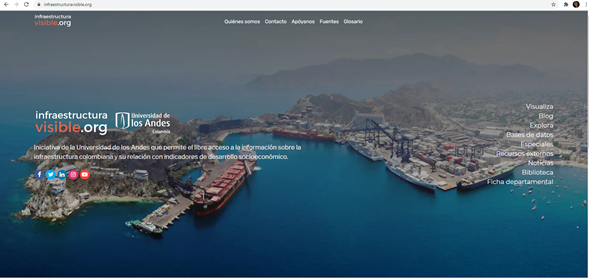

# **Modelo dimensional del proyecto y diseño del proceso ETL**
## **Objetivo**
- Modelar multidimensionalmente la base datos (BD) utilizada para los análisis sugeridos del proyecto.  
- Diseñar el proceso ETL para cargar las tablas que se deben crear asociadas al modelo multidimensional propuesto.
## **Instrucciones**

En esta fase del proyecto, a partir de los análisis requeridos y de fuentes de datos proporcionadas, Infraestructura Visible le solicita:
1.	**Entregable 1- Modelo multidimensional:** Una propuesta de modelo multidimensional que permita realizar los análisis propuestos por la organización. El modelo debe estar acompañado de una descripción y justificación. Modele el proceso de negocio <i>RegistroDeVuelos</i> que se realiza de forma mensual.
2.	**Entregable 2 - Diseño del proceso ETL:** Incluir el diseño ETL propuesto para poblar las tablas asociadas al modelo multidimensional propuesto, utilizando como fuentes, las compartidas. Incluya una descripción general con los elementos que considere son importantes para la comprensión del diseño.

Es importante mencionar que a partir de esta entrega en la nota se evaluará el trabajo en grupo y el trabaja individual. Este último se calcula tomando como base la coevaluación entre miembros de grupo que deben diligenciar.

A continuación, se presentan los análisis propuestos y los datos requeridos para lograr los objetivos de esta tarea.

| Tema analítico  | Análisis requeridos o inferidos | Categoría del análisis (*)  | Procesos de negocio | Fuentes de datos |
| ------------- | ------------- | ------------- | ------------- | ------------- | 
| Comportamiento de vuelos y aeropuertos en Colombia   | Análisis 1   a. Visualizar el número de pasajeros transportados (entrantes y salientes) en un rango de fechas.   b. Visualizar el número de pasajeros transportados (entrantes y salientes) en un rango de fechas de aeropuertos Internacionales a aeropuertos en Colombia o entre aeropuertos nacionales.   c. Visualizar el número de pasajeros transportados (entrantes y salientes) en un rango de fechas por departamento y país  | Tablero de control  | Tráfico y capacidad de carga aérea en aeropuertos de Colombia  | Aeropuertos, Vuelos |
| Comportamiento de vuelos y aeropuertos en Colombia   | Análisis 2   Visualizar el número de puestos desaprovechados en un rango de fechas de aeropuertos Internacionales a aeropuertos en Colombia o entre aeropuertos nacionales, los aeropuertos se pueden agrupar por departamento, país, etc  | Tablero de control  |  Tráfico y capacidad de carga aérea en aeropuertos de Colombia  | Aeropuertos, Vuelos |
| Comportamiento de vuelos y aeropuertos en Colombia   | Análisis 3   Visualizar la carga transportada (entrante y saliente) en un rango de fechas de aeropuertos Internacionales a aeropuertos en Colombia o entre aeropuertos nacionales, los aeropuertos se pueden agrupar por departamento, país, etc  | Tablero de control  |  Tráfico y capacidad de carga aérea en aeropuertos de Colombia  | Aeropuertos, Vuelos |
| Comportamiento de vuelos y aeropuertos en Colombia   | Análisis 4   Visualizar la carga desaprovechada en un rango de fechas de aeropuertos Internacionales a aeropuertos en Colombia o entre aeropuertos nacionales, los aeropuertos se pueden agrupar por departamento, país, etc  | Tablero de control  | Tráfico y capacidad de carga aérea en aeropuertos de Colombia  | Aeropuertos, Vuelos |
| Comportamiento de vuelos y aeropuertos en Colombia   | Análisis 5   Visualizar la información de los aeropuertos que están en centros poblados donde la población de mujeres es mayor a la de hombres, con un PIB, el año de análisis, superior al promedio del Departamento donde está el centro poblado y donde el número de vuelos por mes de un año particular seleccionado está por debajo del promedio nacional ese mismo mes de ese año.  | Tablero de control  | Tráfico y capacidad de carga aérea en aeropuertos de Colombia  | Aeropuertos, Vuelos  |
| Comportamiento de vuelos y aeropuertos en Colombia   | Análisis 6   Visualizar la información de los aeropuertos y/o vuelos en relación a las proyecciones de habitantes por género, edad y pib  | Tablero de control  | Caracterización de los servicios vs comportamiento de los clientes |PIB,  Proyecciones de habitantes por edad y género  |
| Comportamiento de vuelos y aeropuertos en Colombia   | Análisis 7   Visualizar la evolución del aeropuerto en términos de sus características respecto al tiempo | Tablero de control  |  Tráfico y capacidad de carga aérea en aeropuertos de Colombia  | Aeropuertos |

** Los análisis de la tabla pueden ser agrupaciones de análisis más pequeños o se pueden extender, incluso puede que los análisis no estén completos. Es libre de proponerle nuevos análisis al negocio o complementar los de la tabla como parte de sus conclusiones. Piense en que le beneficiaría más a Infraestructura Visible y en paticular a un usuario que esté interesado en este estilo de análisis.

## **Recursos requeridos**
***Datos suministrados***

Los datos los puede encontrar en la base de datos: ProyectoTransaccional del servidor que manejamos en los tutoriales. También puede encontrar el diccionario de los mismos [aquí](https://github.com/MISW-4402-Analisis-y-Modelado-de-datos/guias/blob/main/docs/Proyecto/Diccionario%20IV.xlsx). En esta base de datos, a partir de la entrega de la tarea de entendimiento de datos, va a encontrar tanto las tablas con sufijo y sin sufijo "Copia". Las tablas sin sufijo "Copia" representan las tablas corregidas luego de la revisión del entendimiento de los datos.
Tablas compartidas para el entendimiento de datos
-	aeropuertosCopia
-	divipolaCopia
-	vuelosCopia
-	pibCopia
-	proyeccionesCopia

Tablas corregidas luego del reporte de entendimiento de datos
-	aeropuertos
-	divipola
-	vuelos
-	pib
-	proyecciones

***Respuestas del negocio a conclusiones de Entendimiento*** 

Estarán disponibles después de la entrega de Entendimiento de datos del proyecto.

***Tecnología***

Recuerde los videos y lecturas de modelado multidimensional, que serán de utilidad para el desarrollo de esta tarea.

Adicionalmente, se le sugiere utilizar una herramienta como [GenMyModel](https://www.genmymodel.com/) o [Lucidchart](https://lucid.app/es/users/login#/login?_gl=1*1sru4v4*_ga*MjA1NjkyODI5LjE2NTUzMjA2MzY.*_ga_MPV5H3XMB5*MTY1NTQzMTAyOS4yLjAuMTY1NTQzMTAyOS42MA..&anonId=0.8bb37e0e18168cc6c65&sessionDate=2022-06-17T01:57:06.970Z&sessionId=0.88d2ce41816f60d91a&activate=lucidchart) para dibujar el modelo. Este tipo de herramientas facilita el mantenimiento de los modelos de datos.

## **Recomendaciones de los entregables**
Incluir en la entrega la dirección (URL) de la wiki del repostiro del grupo <i>Proyecto_Gi</i> donde registró lo solicitado en esta tarea

## **Preguntas o más información**
- Las preguntas que surjan en el desarrollo de esta tarea pueden registrarlas en el slack del curso
- Recuerde que tiene a su disposición el tutorial de Creación y manejo de la Wiki [aquí](https://misovirtual.virtual.uniandes.edu.co/codelabs/wiki-github/index.html?index=..%2F..ETL#0)
- Nota grupal aporta un 9%  y nota individual un 1%.
