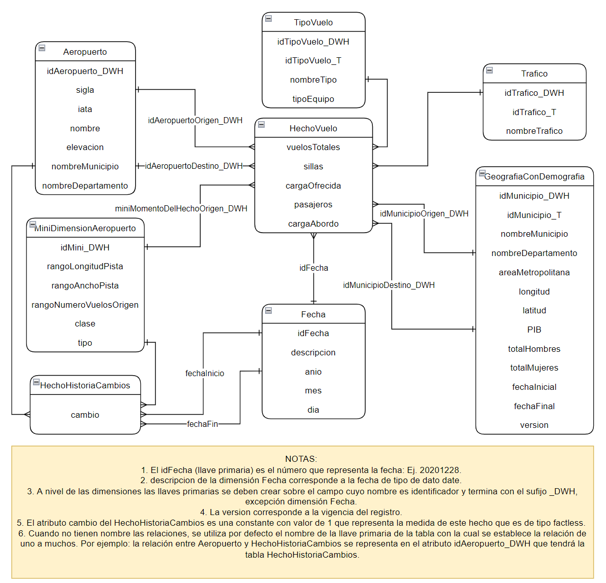

# **Construir un proceso ETL**
## **Objetivo**
- Implementar el proceso ETL del proyecto.  
## **Instrucciones**

En esta fase del proyecto, a partir de la capacitación recibida en los diferentes temas, algunos ejemplos de análisis requeridos, aclaraciones de la organización sobre los datos compartidos inicialmente y de un modelo multidimensional con manejo de historia propuesto, Infraestructura Visible considera que están listos para realizar todo lo relacionado con el proceso de ETL. En particular requiere que trabajen en los siguientes entregables:

1. **Entregable 1 - Diseño del ETL:** Incluir el diseño ETL propuesto para poblar las tablas asociadas al modelo multidimensional dado, utilizando como fuentes, las compartidas. Esto incluye manejo de historia. Recuerde incluir la descripción del diseño. En esta parte puede utilizar como base el diseño del ETL que entregó la semana anterior.
2. **Entregable 2 - Implementación del ETL:** implementación del proceso ETL de las dimensiones y tabla de hechos del proyecto incluyendo manejo de historia.  Recuerde incluir la descripción del proceso de implementación.

A nivel de trabajo en grupo, dada la experiencia que la empresa tiene en este estilo de proyectos, le sugiere lo siguiente:
- Cada miembro del grupo se haga responsable de una dimensión o de dos si la dimensión es básica.
- Definan de forma conjunta el proceso a seguir para las transformaciones y cargue de la tabla de hechos
- El miembro con las dimensiones más sencillas o el menor número de dimensiones asignadas trabaje la tabla de hechos.

Recuerden que la nota de la actividad se calcula tomando como base el aporte grupal y el individual. El individual se calcula usando la información reportada en la coevaluación entre miembros del grupo.

## **Recursos requeridos**
***Datos suministrados***

Los datos los puede encontrar en la base de datos: ProyectoTransaccional del servidor que manejamos en los tutoriales. También puede encontrar el diccionario **actualizado** de los mismos [aquí](https://github.com/MISW-4402-Analisis-y-Modelado-de-datos/guias/blob/main/docs/Proyecto/Diccionario%20IV.xlsx), ambos recursos requeridos para el desarrollo de esta tarea, las tablas son copias de las tablas relacionales del negocio. Los datos que se usaron para el entendimiento de datos quedan disponibles en las tablas <i> aeropuertosCopia, divipolaCopia, vuelosCopia, pibCopia y	proyeccionesCopia </i> en caso de que deseen repasar o rehacer el ejercicio de Entendimiento. Los datos revisados por Infraestructura visible a partir de los resultados y/o conclusiones que obtuvieron en el entenimiento y que deben ser utilizados en el proceso de ETL quedan en las tablas:
-	aeropuertos
-	divipola
-	vuelos
-	pib 
-	proyecciones

Para la fecha, si no hay día o mes asuma como valores por defecto el primer día del mes, y enero como mes por defecto.

***Respuestas del negocio a conclusiones de Entendimiento*** 

**Comentarios generales**
- Infraestructura Visible sugiere que para el manejo de fechas, si no hay día o mes y se requiere, utilizar como valores por defecto el primer día del mes, y el primer mes de cada año
- Infraestructura Visible está de acuerdo con que ustedes eliminen los duplicados totales que encontraron en los datos en las diferentes tablas compartidas
- Infraestructura Visible está de acuerdo con la estandarización de los meses a nivel de las fechas y esta transformación será responsabilidad de ustedes

**Departamentos, Municipios, Centros poblados**
- Se revisaron los datos y se completó la información de los 10 departamentos y los 2 años que faltaban de los datos.
- Infraestructura Visible revisó su comentario sobre problemas de los nombres en los departamentos y encontró efectivamente, diferentes nombres para un mismo departamento, por lo cual les propone estandarizar los nombres en un proceso de transformación que será responsabilidad de ustedes
- Se revisaron los datos y se completó la información de los 2 departamentos que faltaban en los datos y los datos de proyecciones según edad para cada género
- Se revisó la columna constante DP, que representa el código del departamento y se asignaron los valores correctos
- Se revisaron las columnas Código Departamento y Nombre Municipio de la tabla divipolaCopia, se corrige el nombre del municipio pero les solicita corregir el código del departamento, usando como base la tabla de PIB. 
- Los valores de longitud y Latitud de divipola fueron corregidos
- Con respecto a los nombres de los departamentos que presentan errores,  el negocio les recomienda primero estandarizar los nombres haciendo uso de diccionarios y luego revisar duplicados para finalmente lograr hacer las integraciones que sean necesarias 
- Se eliminaron los registros inconsistentes, donde aparecia el mismo centro poblado ubicado en distintos puntos geográficos según sus variables de latitud y longitud

**Proyecciones y PIB**
- Las proyecciones no hacen referencia a cantidad de vuelos, son proyecciones de población, es decir habitantes vivos por departamento para un año
- El valor real de hombre para Valle del Cauca en 2014 es incorrecto, les piden que hagan la corrección (les recomendamos pensar en este caso, con los datos que tienen, ¿cuál es el mejor método de imputación?)
- Infraestructura Visible, les solicitan imputar el valor extremo de la variable <i>total Mujeres</i>
- El PIB es una medida de valor agregado, sus medidas son heterogéneas
- Los totales son la suma por edad o genero. Ej Total 57 = Mujeres 57 +Hombres 57, Total Hombres = SUM(Hombres_i). Las proyecciones especificas son calculadas por el DANE a partir de los censos nacionales
- Con respecto a la regla 2 de negocio que dice "se tiene la información de proyecciones de vida por género y edad para los 32 departamento desde 2005 a 2015" se aclara que la información incluída va hasta diciembre de 2014.

**Aeropuertos**
- Infraestructura Visible les recuerda que el año de inicio para la bodega de datos es 2015, pero que cuenta con información desde 1957 y la historia de cambio se empezó a registrar desde 2015 y se tiene historia hasta 2017
- Se completó la información de aeropuertos origen y destino que faltaba para aeropuertos colombianos
- Se corrigieron los valores de longitud de pista, se agregaron las categorías para los aeropuertos que no son aeródromos
- Se revisó la columna constante de Latitud de los aeropuertos y se corrigieron los valores
- Identificó el problema con número de vuelos origen negativos y les solicita que corrijan esos valores negativos multiplicando por -1
- Los datos compartidos de aeropuertos no incluyen los aeropuertos internacionales. En esta iteración, la dimensión de aeropuertos tendrá solo información de aeropuertos colombianos.
- A pesar del esfuerzo para recolectar información de dimensiones de aeropuerto y de número de vuelos para los cuales fueron diseñados, hay varios de ellos donde no fue posible encontrar esta información. En este caso, se utiliza el valor de 0 como comodín en los campos donde no se cuenta con este dato.

**Vuelos**
- Las siglas de tráfico significan: N = Nacional, I = Internacional, E= postal o urgentes. Las siglas de tipos de vuelos significan: R= regular, T= taxi, C= chárter, A= adicionales
- Infraestructura visible nos aclara que las unidades de las variables carga_bordo y carga_ofrecida son kilogramos.
- Infraestructura Visible les comenta que se hicieron las revisiones y se quitaron los registros duplicados para los aeropuertos que coincidian en nombre y variaban en las columnas carga_bordo, carga_ofrecida y pasajeros_en_vuelos de la tabla de vuelos

**Integración**
- La integración entre divipola y aeropuertos debe realizarse utilizando los códigos de municipio ya que los aeropuertos están asociados únicamente a municipios. En particular, les sugiere utilizar las columnas gcd_municipio y gcd_departamento a nivel de aeropuertos y relacionarlas con las columnas código municipio y código de departamento de divipola.
- La integración entre aeropuertos y vuelos se hace respectivamente por medio de la Sigla y los campos origen o destino.

***Modelo multidimensional propuesto*** 

El modelo propuesto muestra dos tablas de hecho. La primera de ellas **HechoVuelo**, representa el proceso de registro de vuelos que es un histórico de los vuelos realizados desde o hacia aeropuertos en Colombia entre 2004 y 2017. La granularidad del hecho es de carácter mensual, y cada registro contiene el mes-año, aeropuerto de origen, aeropuerto de destino, municipio (representado por la dimensión GeografíaConDemografía), al cual fue asignado el aeropuerto, las características del aeropuerto en el momento del reporte, tipo de vuelo (Chárter, Regular, Taxi o Adicionales, etc.), tipo de tráfico (Internacional, Nacional, etc.), total de vuelos realizados y el número total de sillas en esos vuelos, carga ofrecida para los vuelos realizados, pasajeros que viajaron y generaron ingresos a la aerolínea y carga a bordo de los vuelos. 

La segunda tabla de hechos **HechoHistoriaCambios** almacena la historia de los cambios realizados en los aeropuertos a nivel de longitud, ancho, clase, tipo, número de vuelos teniendo como origen ese aeropuerto y dado que es una *factless*, como medida se adicionó el campo cambio que es una constante de valor “1”.

Con respecto al manejo de historia de atributos, **GeografíaConDemografía** tiene un **manejo tipo 2** que permite registrar entre otros cambios las proyecciones. Mientras que, para **aeropuerto**, se propuso un **tipo 4**, creándose la minidimensión MiniDimensiónAeropuerto. En esta ocasión, el modelo multidimensional compartido a nivel de los hechos, no incluye las FK con las dimensiones. Sin embargo, están representadas de forma implicita por las relaciones uno a muchas y deben ser consideradas durante el proceso de ETL.

**GeografíaConDemografía** contiene toda la información relacionada con la geografía y con el manejo de los vuelos. Es así como contiene información especifica del Departamento como es: el nombre, el PIB, el total Hombres y total Mujeres. Mientras que, para la información del municipio contiene el nombre, el área metropolitana, la latitud y la longitud. Esto facilitará los análisis cuando incluyan esta dimensión.

**Idea para los rangos**: El manejo de los rangos en la minidimensión, puede hacerlos con los cuartiles, así el primer rango va de R1:[0-valor del 25%), R2:[Valor del 25%,Valor del 50%), R3: [Valor del 50%, Valor del 75%), R4: > valor del 75%.

Recuerde que el carácter “[ ]” representa inclusión en el rango, mientras que el carácter “( )” no.

***Tecnología***

Recuerden que están los tutoriales "Proceso ETL" y "Proceso ETL Incremental"

## **Recomendaciones de los entregables**

Incluir en la entrega la dirección (URL) de la wiki del repositorio del grupo <i>Proyecto_Gi</i> donde registró lo solicitado en esta tarea con las actividades realizadas dentro de las fechas establecidas

## **Preguntas o más información**
- Si el cargue de datos con la función <i>guardar_db()</i> se demora, hacer uso del código de cargue por lotes que encuentra en el Tutorial de ETL al final del bloque 6: Hecho orden. Revíselo y ajústelo de acuerdo con las necesidades que tenga.
- Recuerde que puede hacer reemplazos de cadenas de caracteres haciendo uso de diccionarios, puede encontrar ejemplos en el siguiente enlace: https://sparkbyexamples.com/pyspark/pyspark-replace-column-values/
- Las preguntas que surjan en el desarrollo de esta tarea pueden registrarlas en el slack del curso
- Recuerde que tiene a su disposición el tutorial de Creación y manejo de la Wiki [aquí](https://misovirtual.virtual.uniandes.edu.co/codelabs/wiki-github/index.html?index=..%2F..ETL#0)
- Nota grupal aporta un 9% y la nota individual un 1%.
