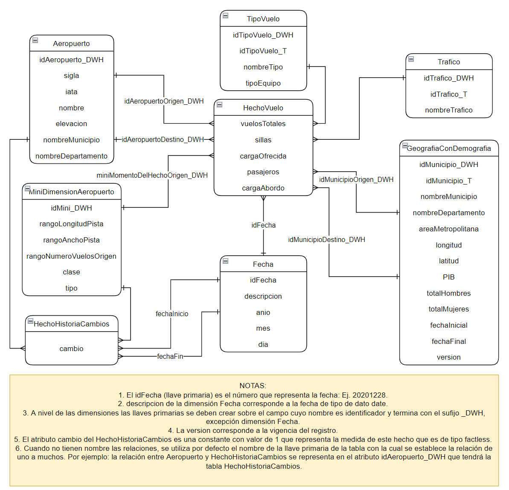

# **Construir un proceso ETL**
## **Objetivo**
- Implementar el proceso ETL del proyecto.  
## **Instrucciones**

En esta fase del proyecto, a partir de la capacitación recibida en los diferentes temas, algunos ejemplos de análisis requeridos, aclaraciones de la organización sobre los datos compartidos inicialmente y de un modelo multidimensional con manejo de historia propuesto, Infraestructura Visible considera que están listos para realizar todo lo relacionado con el proceso de ETL. En particular requiere que trabajen en los siguientes entregables:

1. **Entregable 1 - Diseño del ETL:** Incluir el diseño ETL propuesto para poblar las tablas asociadas al modelo multidimensional dado, utilizando como fuentes, las compartidas. Esto incluye manejo de historia. Recuerde incluir la descripción del diseño. En esta parte puede utilizar como base el diseño del ETL que entregó la semana anterior.
2. **Entregable 2 - Implementación del ETL:** implementación del proceso ETL de las dimensiones y tabla de hechos del proyecto incluyendo manejo de historia.  Recuerde incluir la descripción del proceso de implementación.

A nivel de trabajo en grupo, dada la experiencia que la empresa tiene en este estilo de proyectos, le sugiere lo siguiente:
- Cada miembro del grupo se haga responsable de una dimensión o de dos si la dimensión es básica.
- Definan de forma conjunta el proceso a seguir para las transformaciones y cargue de la tabla de hechos
- El miembro con las dimensiones más sencillas o el menor número de dimensiones asignadas trabaje la tabla de hechos. 

## **Recursos requeridos**
***Datos suministrados***

Los datos los puede encontrar en la base de datos: ProyectoTransaccional del servidor que manejamos en los tutoriales. También puede encontrar el diccionario **actualizado** de los mismos [aquí](https://github.com/MISW-4402-Analisis-y-Modelado-de-datos/guias/blob/main/docs/Proyecto/Diccionario%20IV.xlsx), ambos recursos requeridos para el desarrollo de esta tarea, las tablas son copias de las tablas relacionales del negocio. Los datos que se usaron para el entendimiento de datos quedan disponibles en las tablas <i> aeropuertosCopia, divipolaCopia, vuelosCopia, pibCopia y	proyeccionesCopia </i> en caso de que deseen repasar o rehacer el ejercicio de Entendimiento. Los datos revisados por Infraestructura visible a partir de los resultados y/o conclusiones que obtuvieron en el entenimiento y que deben ser utilizados en el proceso de ETL quedan en las tablas:
-	aeropuertos
-	divipola
-	vuelos
-	pib 
-	proyecciones

Para la fecha, si no hay día o mes asuma como valores por defecto el primer día del mes, y enero como mes por defecto.

***Respuestas del negocio a conclusiones de Entendimiento*** 

Estarán disponibles después de la entrega de Entendimiento de datos del proyecto.

***Modelo multidimensional propuesto*** 

El modelo propuesto muestra dos tablas de hecho. La primera de ellas **HechoVuelo**, representa el proceso de registro de vuelos que es un histórico de los vuelos realizados desde o hacia aeropuertos en Colombia entre 2004 y 2017. La granularidad del hecho es de carácter mensual, y cada registro contiene el mes-año, aeropuerto de origen, aeropuerto de destino, municipio (repreentado por la dimensión GeografíaConDemografía), al cual fue asignado el aeropuerto, las características del aeropuerto en el momento del reporte, tipo de vuelo (Chárter, Regular, Taxi o Adicionales, etc.), tipo de tráfico (Internacional, Nacional, etc.), total de vuelos realizados y el número total de sillas en esos vuelos, carga ofrecida para los vuelos realizados, pasajeros que viajaron y generaron ingresos a la aerolínea y carga a bordo de los vuelos. 
La segunda tabla de hechos **HechoHistoriaCambios** almacena la historia de los cambios realizados en los aeropuertos a nivel de longitud, ancho, clase, tipo, número de vuelos teniendo como origen ese aeropuerto y dado que es una *factless*, como medida se adicionó el campo cambio que es una constante de valor “1”.

Con respecto al manejo de historia de atributos, **GeografíaConDemografía** tiene un **manejo tipo 2** que permite registrar entre otros cambios las proyecciones. Mientras que, para **aeropuerto**, se propuso un **tipo 4**, creándose la minidimensión MiniDimensiónAeropuerto. En esta ocasión, el modelo multidimensional compartido a nivel de los hechos, no incluye las FK con las dimensiones. Sin embargo, están repreentadas de forma implicita por las relaciones uno a muchas y deben ser consideradas durante el proceso de ETL.

**Idea para los rangos**: El manejo de los rangos en la minidimensión, puede hacerlos con los cuartiles, así el primer rango va de R1:[0-valor del 25%), R2:[Valor del 25%,Valor del 50%), R3: [Valor del 50%, Valor del 75%), R4: > valor del 75%.

Recuerde que el carácter “[ ]” representa inclusión en el rango, mientras que el carácter “( )” no.

***Tecnología***

Recuerden que están los tutoriales "Proceso ETL" y "Proceso ETL Incremental"

## **Recomendaciones de los entregables**

Incluir en la entrega la dirección (URL) de la wiki del repositorio del grupo <i>Proyecto_Gi</i> donde registró lo solicitado en esta tarea con las actividades realizadas dentro de las fechas establecidas

## **Preguntas o más información**
- Si el cargue de datos con la función <i>guardar_db()</i> se demora, hacer uso del código de cargue por lotes que encuentra en el Tutorial de ETL al final del bloque 6: Hecho orden. Revíselo y ajústelo de acuerdo con las necesidades que tenga.
- Recuerde que puede hacer reemplazos de cadenas de caracteres haciendo uso de diccionarios, puede encontrar ejemplos en el siguiente enlace: https://sparkbyexamples.com/pyspark/pyspark-replace-column-values/
- Las preguntas que surjan en el desarrollo de esta tarea pueden registrarlas en el slack del curso
- Recuerde que tiene a su disposición el tutorial de Creación y manejo de la Wiki [aquí](https://misovirtual.virtual.uniandes.edu.co/codelabs/wiki-github/index.html?index=..%2F..ETL#0)
