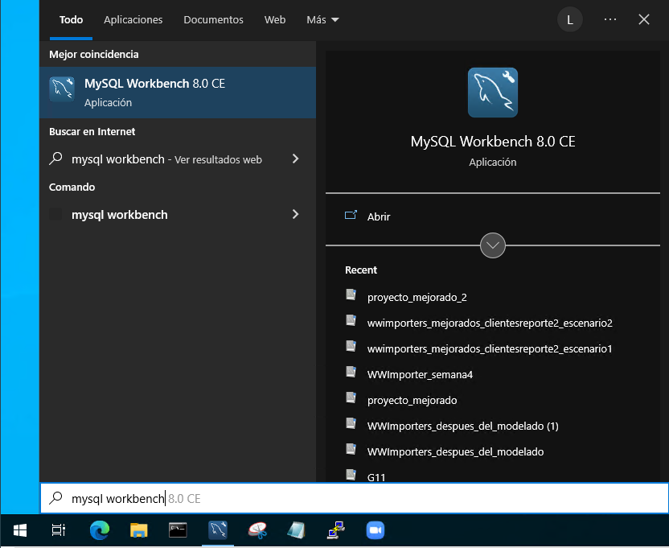
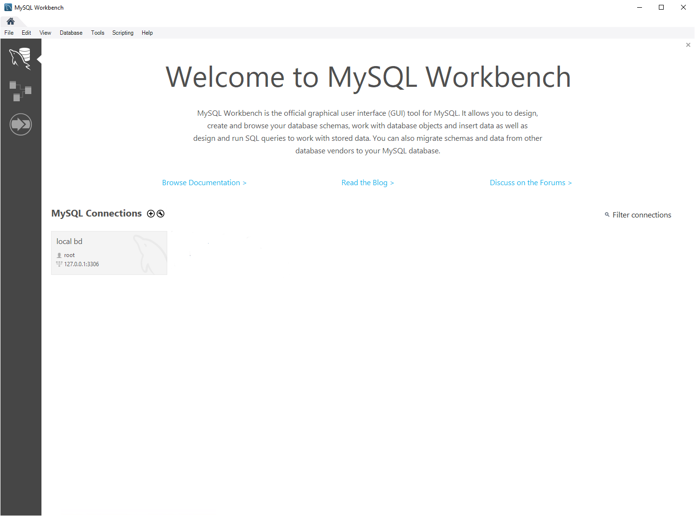
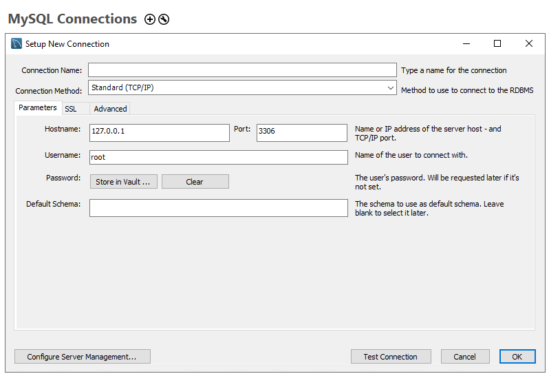
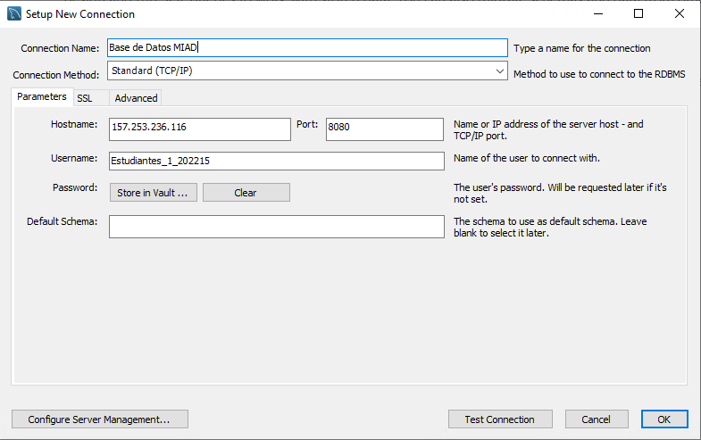
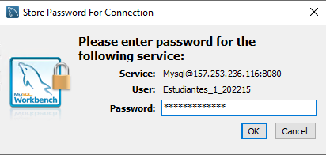
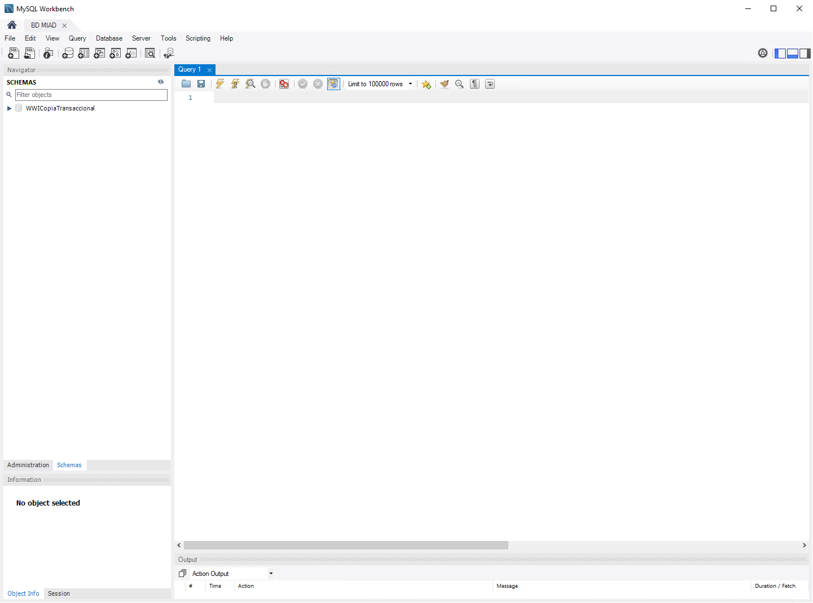
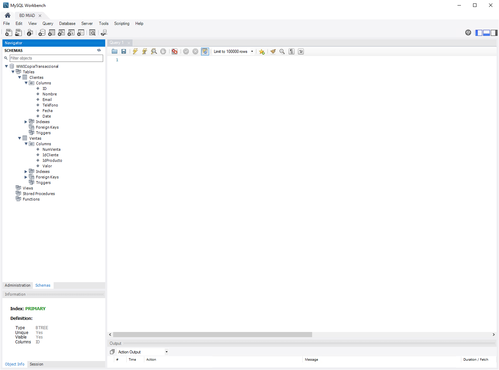
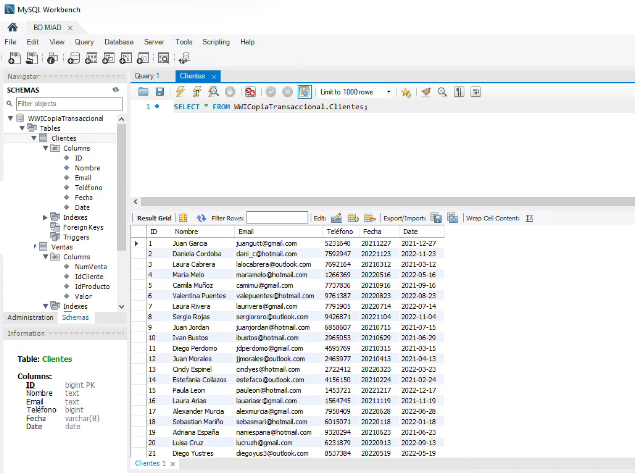
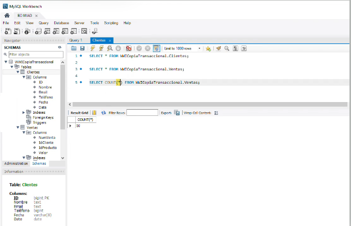

# Tutorial: Sentencias SQL

## Introducción

**Objetivo**

En este tutorial aprenderá a ejecutar sentencias SQL en MySQL Workbench.

**¿Qué construirá?**
- Construirá varias sentencias en MySQL Workbench.

**¿Para qué?**

Aprender sobre las sentencias básicas en MySQL y la interfaz de MySQL Workbench.

**¿Qué necesita?**

1. MySQL Workbench.
2. Acceso al servidor de base de datos.

## Enunciado
Diríjase a la aplicación de MySQL Workbench.

Agregue una nueva conexión a una base de datos MySQL.

Del documento de credenciales que encuentra en la sección de conexión a máquinas virtuales, use su usuario y clave. Digite el nombre que le quiere poner a la conexión en *Connection Name*, la dirección IP del servidor en *Hostname* (e.g., 157.253.236.116) y el puerto en *Port* (8080).

Digite en *Username* su usuario indicado en el documento de credenciales. Ejemplo: **Estudiante_1_202215**. En *Password* presione el botón *Store in Vault* y agregue la contraseña asignada a su usuario en la pestaña emergente.

Una vez establecida la conexión va a poder ejecutar sentencias SQL en el editor identificado como Query 1.

En la parte izquierda se encuentran las bases de datos a las que tiene acceso. En esta ocasión se utilizará la base de datos **WWICopiaTransaccional**.

Si despliega la base de datos encontrará una pestaña para las tablas y dentro de ellas, las tablas que componen esa base de datos. Al desplegar cada tabla encuentra información importante como las columnas, índices, llaves foráneas. Despliegue las columnas para encontrar el nombre de las columnas en cada tabla.

Se procederá con las sentencias para explorar las tablas que se encuentran en la base de datos WWICopiaTransaccional. En particular, te invitamos a realizar los ejercios que están en el recurso de ejercicios SQL. Ejemplos de ellos, los podrás ver en las siguientes figuras y revisar en detalle en el video que acompaña este tutorial.

# Cierre
Al terminar este tutorial, el estudiante está en capacidad de ejecutar sentencias en MySQL Workbench.

# Más información
Para más información de sentencias SQ, consulte el siguiente enlace: https://www.w3schools.com/sql/
