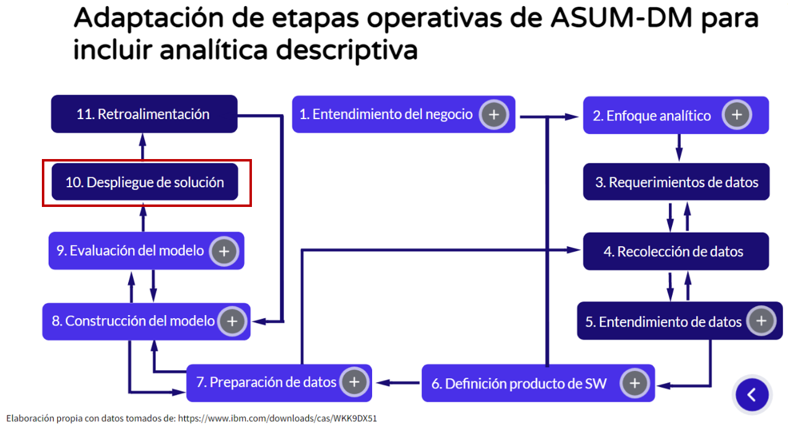

# Autodiagnóstico: Uso de tableros de control
Recordemos que Wide World Importers nos contrató como consultores para hacer un proyecto de analítica 1.0, en el cual quiere entender el comportamiento de los clientes o vendedores a partir de órdenes de venta, con el fin de monitorear el logro de sus objetivos estratégicos. Es así como en ese proyecto se tenía la siguiente documentación de los requerimientos analíticos:

| **Tema analítico**                                               | **Análisis requeridos o inferidos**                                                                                                       | **Categoría del análisis (\*)** | **Procesos de negocio** | **Fuentes de datos**                                                    |
| ---------------------------------------------------------------- | ----------------------------------------------------------------------------------------------------------------------------------------- | ------------------------------- | ----------------------- | ----------------------------------------------------------------------- |
| **Comportamiento de clientes a partir de órdenes** **de compra** | Visualizar la cantidad de productos vendidos y el valor total recaudado en un **rango de fechas** por cliente, vendedor, ciudad, producto | Tablero de control              | Ventas                  | Ordenes, detalles de órdenes, clientes, productos, ciudades, vendedores |
 
 Y fue la base para desarrollar el tablero de control "Comportamiento de clientes a partir de órdenes de compra" construido con Data Studio. Dados algunos problemas de eficiencia que se evidenciaron en el uso del tablero, se crearon tres tableros distintos, los cuales utilizan diferente cantidad de datos: 

- [1.000 registros](https://datastudio.google.com/reporting/1b8e432d-3d2d-4f8b-8174-30f992f72dae)
- [50.000 registros](https://datastudio.google.com/reporting/2972ff51-1887-4a12-8df1-2ac6891e5699)
- [145.000 registros](https://datastudio.google.com/reporting/9321febb-c8c7-4b0b-94ac-45a82f8b2ba5)

[^1]: Caso inspirado en: [https://docs.microsoft.com/en-us/sql/samples/wide-world-importers-what-is?view=sql-server-ver15](https://docs.microsoft.com/en-us/sql/samples/wide-world-importers-what-is?view=sql-server-ver15)

# Tablero de control

Según la metodología ASUM-DM, en este tutorial nos concentramos en el uso de un tablero de control que fue la aplicación desplegada en la etapa número 10 (&quot;Despliegue de solución&quot;). Por otra parte, a nivel de arquitectura de componentes estamos en la capa de aplicación y vamos a simular la interacción de un usuario final con dicha aplicación.

El tablero consulta los datos de un servidor de base de datos MySQL para resolver las necesidades o requerimientos analíticos. Brinda filtros sobre clientes, empleados, fechas, ciudades y productos.

# Ejemplo de análisis sobre un tablero de control

La construcción de un tablero de control no es suficiente para generar valor a una organización. Lo recomendado es dar algunas ejemplos concretos del uso del tablero, que den valor al negocio en forma de hallazgos que soportarán posibles decisiones o acciones. A continuación, se presenta un ejemplo de uso del tablero de control.

"Juana Valencia  abogada corporativa de Wide World Importes (perteneciente al área jurídica de la organización) ha iniciado su interacción con el tablero de comportamiento de clientes con el fin de investigar el comportamiento de ventas y su relación con la cantidad de productos vendidos, la tasa de impuesto autorizada por los diferentes estados de EEUU y los vendedores involucrados en dichas ventas. Haciendo uso del tablero y muy enfocada en estados donde la probabilidad de fraude es mayor, encuentra que para el **año 2015 en Willow Valley la cantidad vendida y el valor (U$403,57 -- como se ilustra en la siguiente figura), ** tomando la tasa de impuesto, no corresponde a lo permitido por la ley local. Lo cual la lleva a identificar **dos empleados relacionados con dichas ventas (Hudson y Kayla)**". Este hallazgo, le permitió a la abogada fortalecer los cargos contra los empleados para iniciar una investigación jurídica que podría significar el hallar una fuga de dinero que corresponde a un 0,01% del total de ventas por año. Una cifra nada despreciable, pero que hasta la actualidad había permanecido oculta por la dificultad de poner a disposición de los abogados este tipo de herramientas que aportan en su eficiencia operativa. De igual manera, con esta identificación pidió la generación de un nuevo tablero de control, con el fin de validar cumplimientos regulatorios. El hallazgo identificado por Juana es de suma importancia para ella y está alineado con una de sus responsabilidades:  "Garantizar el cumplimiento de las regulaciones y las leyes". 

# Ejercicio
En el ejemplo previo, vemos como es de importante tender claridad del rol que usará el tablero de control para entender las respuestas que busca al utilizarlo. Es así, como en el proceso de desarrollo de este estilo de proyectos se debe tener claridad del usuario(s) del tablero, antes de desarrollarlo  para aumentar las condiciones de éxito de este tipo de proyectos. En este punto, te invito a utilizar uno de los tableros compartidos, para simular su uso, definiendo un rol, unas funciones asociadas a dicho rol y, en particular generando una conclusión  de uso como la del ejemplo, en la cual debes incluir:

1. El rol de la organización que se beneficia con el uso de este tablero de control, al igual el área a la que pertenece. Esta información es la que quieras "inventar" acorde al sector de retail, dado que no la tenemos para WWImporters.
2. Un nuevo hallazgo obtenido al utilizar el tablero de control y evidencia de su identificación en una imágen sobre el tablero de control.
3. La alineación entre el hallazgo y las funciones de ese rol, los objetivos de Wide World Importers o del área a la que pertenece el rol. Si lo consideras necesario puedes extender el caso para darle sentido, tal como se hizo en el ejemplo.
4. Dos acciones/decisiones posibles que el rol puede tomar usando el hallazgo sobre el tablero de control.

Reflexiona sobre lo difícil que fue realizar esta actividad de forma posterior a la construcción del tablero de control. Al nivel del proyecto, esta será una de las actividades iniciales.

