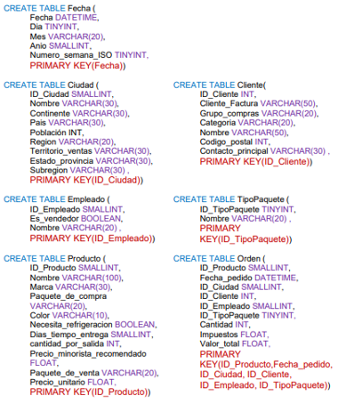
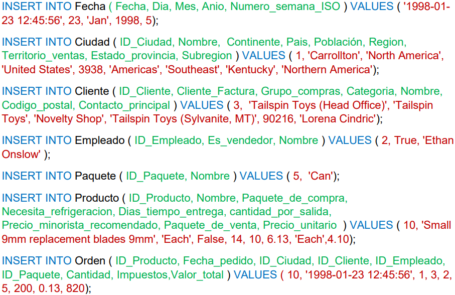
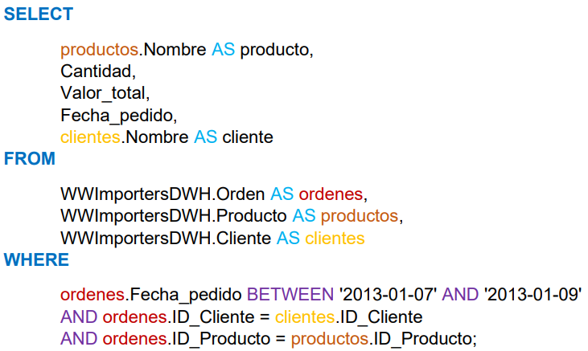
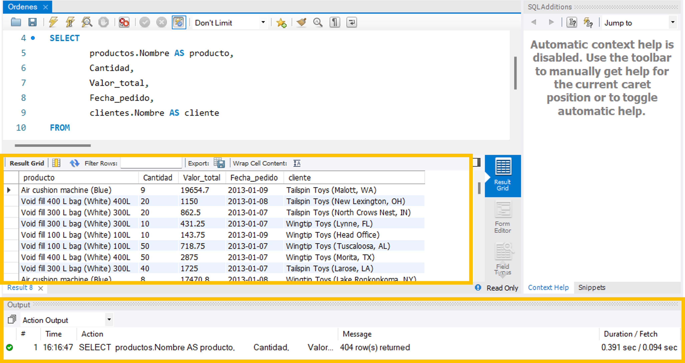

# Tutorial: Representación ROLAP de un modelo multidimensional y acceso a los datos

## Introducción

**Objetivo**

En este tutorial aprenderá la relación entre el diseño de un modelo dimensional y el sql relacionado. 

**¿Qué construirá?**
- Entendimiento sobre un resultado de un proceso de modelado de datos y ETL
- Poblar la base de datos del caso Wide World Importers dado el requerimiento analítico, modelo multidimensional y sentencias de creación de la base de datos
- Resolver el requerimiento analítico con consultas a la base de datos

**¿Para qué?**

Entender la relación entre SQL y el modelo multidimensional

**¿Qué necesita?**

1. MySQL Workbench
2. Modelo multidimensional de ordenes de Wide World Importers
3. Credenciales de acceso a la base de datos
4. Script SQL [aquí](./script.sql)

## Enunciado

El modelo multidimensional para el proceso de pedidos de Wide World Importers se muestra a continuación, consta de 6 dimensiones: Producto, Paquete, Empleado, Cliente, Ciudad y Fecha.
 

Para conectarse a la base de datos por medio de una interfaz de usuario utilice MySQL Workbench. Cree una nueva conexión, digite un nombre, la dirección ip y puerto del servidor de base de datos

Una vez establecida la conexión va a poder ejecutar sentencias SQL en el editor señalado en la siguiente imagen

Las sentencias SQL para crear este modelo en MYSQL, la sintaxis de la sentencia CREATE SQL es: 
CREATE TABLE nombre_de_la_tabla ( LISTA DE ATRIBUTOS CON SU TIPO DE DATO Y RESTRICCIONES), las siguientes son las sentencias para el modelo del hecho de ordenes de Wide World Importers

A continuación, encuentra ejemplos de sentencias INSERT para cada tabla, la sintaxis de esta sentencia es 
INSERT INTO base_de_datos.nombre_de_la_tabla (LISTA DE ATRIBUTOS) VALUES ( LISTA DE VALORES ). 

La lista de atributos y la lista de valores deben seguir el mismo orden

Cada vez que ejecute una sentencia en Workbench en la parte inferior, sección Output o salida, van a ver el resultado de la sentencia y un mensaje que les da información en caso de errores 
 
Con las bases de datos llenas se puede hacer una primera aproximación a resultado del requerimiento planteado en el tutorial de Uso de tableros de control a partir de consultas al cubo multidimensional
 
| **Tema analítico**                                               | **Análisis requeridos o inferidos**                                                                                                       | **Categoría del análisis (\*)** | **Procesos de negocio** | **Fuentes de datos**                                                    |
| ---------------------------------------------------------------- | ----------------------------------------------------------------------------------------------------------------------------------------- | ------------------------------- | ----------------------- | ----------------------------------------------------------------------- |
| **Comportamiento de clientes a partir de órdenes** **de compra** | Visualizar la cantidad de productos vendidos y el valor total recaudado en un **rango de fechas** por cliente, vendedor, ciudad, producto | Tablero de control              | Ventas                  | Ordenes, detalles de órdenes, clientes, productos, ciudades, vendedores |
 
Para visualizar los resultados de los clientes, seleccionamos por medio de la sentencia SELECT las métricas que el requerimiento nos solicita: Cantidad de productos vendidos y valor total recaudado, así como columnas que nos ayudan a identificar el nombre del producto, la fecha de la orden y el nombre del cliente. Con el FROM le indicamos a la consulta cuáles son las fuentes o tablas de los datos que queremos y en el WHERE agregamos los filtros o condiciones necesarias para que los datos funcionen, en nuestro caso es un filtro de fechas y dos para unir los datos de órdenes, clientes y productos usando sus ID’s

Un resultado de este proceso es una imagen donde se pueda observar los datos resultado de la consulta, si la misma fue exitosa o no y los tiempos que tomó ejecutar dicha consulta tal como se observa en la siguiente imagen

# Cierre
Al terminar este tutorial, el estudiante está en capacidad de relacionar un modelo dimensional con sentencias SQL y su representación en base de datos

# Más información
Para mayor información de la creación de tableros de control en Data Studio, consulte el siguiente enlace: https://support.google.com/datastudio/answer/6283323?hl=es 
Para mayor información sobre SQL consulte: 
