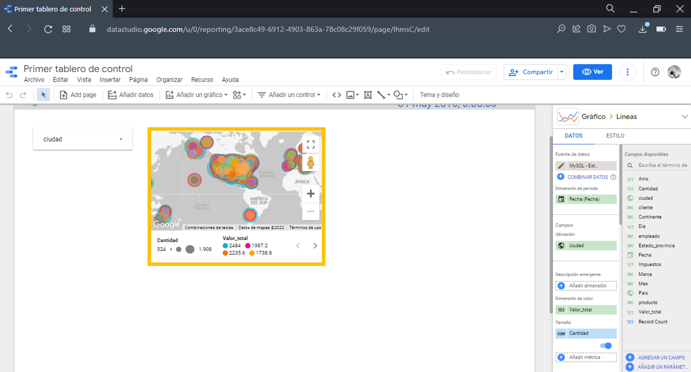

# Tutorial: Crear tableros de control

## Introducción

**Objetivo**

En este tutorial aprenderá a crear un tablero de control usando Google Data Studio

**¿Qué construirá?**
- Un tablero de control

**¿Para qué?**

Visualizar los resultados y facilitar la interacción de los tomadores de decisiones

**¿Qué necesita?**

1. Google data studio: https://datastudio.google.com
2. Acceso al servidor de base de datos
3. [Script auxiliar de creación de la tabla base](crearTableroScript.sql)

## Enunciado
Diríjase al link de data studio, de clic en "USE IT FOR FREE" e inicie sesión en su cuenta gmail.

Luego de clic en Informe vacío y diligencie los datos que le solicita asi como preferencias de notificaciones. Por ejemplo, Region: Colombia

Cambie el nombre del tablero en la esquina superior izquierda

En la barra de herramientas de clic en añadir datos. En la barra de búsqueda que aparece, digite mysql y seleccione el conector de MySQL que observa en la siguiente imagen

Autorize el acceso a los datos y configure el  conector de la siguiente manera, use las credenciales de acceso al servidor dadas en la semana 1 del curso (<i>Estudiante_i</i>) y conéctese a la base de datos que modela su bodega de datos.

Una vez conectado podrá ver las tablas disponibles para consultas

Idealmente en las herramientas de visualización quisieramos poder tomar diferentes tablas y obtener lo necesario para las gráficas, sin embargo las herramientas del mercado son muy limitadas en cuanto a escalabilidad, manipulación de datos sencilla entre otras. Data Studio en particular no soporta la unión de varias tablas, por lo cual es necesario hacer uso de "vistas" SQL o simplemente crear una tabla en la base de datos que tenga la información que deseamos visualizar en Data Studio. Recuerde que si se trata de una vista, la información se actualiza de forma automática cada vez que se agregan filas a las tablas originales. Sin embargo, este comportamiento no ocurre si se tiene una tabla y será necesario recrearla cada vez que se ingresen nuevos datos. A continuación mostramos la sentencia SQL para crear una vista

Sin embargo hemos visto que Data Studio funciona mejor cuando hacemos uso de tablas y no de vistas, por lo cual, nos dirijimos a MySQL Workbench y creamos una tabla nueva con todo lo que queremos visualizar haciendo uso de las sentencias CREATE TABLE y SELECT/INSERT, en este ejemplo mostramos las sentencias por aparte

Puede encontrar las sentencias en el script adjunto  <a href='./crearTableroScript.sql'>crearTableroScript.sql</a>

Con la tabla ya creada podemos consultarla desde Data Studio, seleccionandola y luego dando clic en <i>Añadir</i>

Para revisar y/o modificar la fuente de datos seleccionela de la lista en el costado derecho y de clic en el lapiz para editar

En el costado izquierdo superior encuentra <i>Editar la conexión</i> donde puede cambiar la IP, puerto, credenciales y tabla.

En el costado superior derecho encuentra el tiempo de actualización de datos que puede modificar, opciones para agregar campos y el botón de guardar los cambios "HECHO". En el costado izquierdo se listan los campos reconocidos de la tabla, revise los tipos de datos pues pueden no ser correctos, por ejemplo el Valor_total lo reconoce como un tipo de dato Fecha.

Para cambiar el tipo de dato, damos clic en el menú desplegable de tipos de datos y seleccionamos el nuevo tipo

El primer paso es el banner del tablero, no es obligatorio pero es aconsejable tomar en cuenta aspectos de diseño como este. Para el banner vamos a agregar un rectángulo, dando clic en el ícono de figuras en la barra de herramientas superior y seleccionando el rectángulo

Luego arrastramos en el área blanca donde queremos que esté la figura.

Una vez creada la figura, en el costado derecho aparece un menú de configuración, en este caso podemos personalizar temas de diseño como el color

Ahora agregamos el logo de Wide World Importers, para lo cual le damos clic al ícono de imaágenes y luego clic en la opción que desee

Hay herramientas de diseño gratuitas que puede usar, por ejemplo queremos una paleta de colores en relación con los logos del las empresas, podemos usar un creador de paletas como: https://color.adobe.com/es/create/color-wheel en las que vemos varias opciones según la teoría del color.

Ahora agregamos el título, debe ser muy concistente con el requerimiento analítico que estamos desarrollando. Para esto de clic en el icono de texto en la barra de herramientas

Lo siguiente son las fechas de los datos, que vamos a poner en el costado superior derecho. Para esto damos clic en <i>Añadir un gráfico</i> y seleccionamos una <i>Tarjeta de resultados total</i>

En el menú de configuración vamos a encontrar una nueva ventana <i>DATOS</i> subdividido en configuración y en datos disponibles, estos datos son los campos presentes en la fuente de datos. Para obtener la fecha inicial de los datos, arrastramos el campo Fecha a Dimensión de periodo

Lo siguiente es la Métrica, damos clic en el recuadro azul "Record Count"

En el recuadro que aparece le damos clic en CREAR CAMPO

En el siguiente recuadro le damos un nombre a la nueva métrica y el espacio que corresponde a "Fórmula" usamos la función MIN (MAX, SUM, AVG) para obtener los valores que deseamos. Luego damos clic en APLICAR

Hacemos un proceso similar para la fecha final de manera que se obtenga algo similar a esto:

Para añadir filtros damos clic en <i>Añadir un control</i> y clic en Lista desplegable y ubicamos el elemento en el área de trabajo. En el menú de configuración lateral seleccione el campo por el que se va a filtrar, en el ejemplo seleccionamos ciudad.

Observe que también podemos configurar una Métrica, si no agregamos nada en la lista solo se van a ver los valores del atributo seleccionado

Pero si agregamos una Métrica en la lista vamos a ver los valores correspondientes de esa metrica

Para la primera gráfica queremos ver el Valor total y cantidad de productos vendidos geográficamente. Damos clic en Añadir un gráfico y luego en Mapa de burbujas en la sección de Google Maps, ubicamos el elemento en el espacio de trabajo 

En el menú de configuración agregamos la Fecha en Dimensión de periodo, en Campos-ubicacion agregamos el campo de ubicación geografica -Continente, pais, ciudad, estado o provincia-, en Dimensión de color y en tamaño de las burbujas agregamos las dos medidas

Para el segundo diagrama queremos ver el valor total en ventas por fecha y cliente, para esto seleccionamos un gráfico de lineas

En el menú de configuración, para el eje Y agregamos el valor total en en Métrica, para el eje X ponemos el Año en Dimensión, para tener varias lineas, ponemos en dimensión desglose el campo cliente

Para el tercer diagrama, queremos ver la cantidad de cada producto comprada por cliente, para esto seleccionamos un gráfico de diagramas apiladas

En el menú de configuración, ponemos campo cliente como Dimensión, producto como dimensión de desglose y en métrica la cantidad

Para el cuarto diagrama, queremos ver cuánto vende cada empleado del total vendido, para esto seleccionamos un gráfico circular

En el menu de configuración ponemos en dimension el empleado y en métrica el valor total

Otro filtro importante es el de las fechas, par agregarlo damos clic en Añadir un control y luego clic en Filtro por periodo, no es necesario configurarlo

Recuerde agregar titulos por gráfica, las leyendas y todo aquello que se abordó en esta temática de tableros de control sobre buenas prácticas. 

### Publicar/Compartir el tablero de control
Para compartir su tablero de clic en el boton de "Compartir" en el menu superior al costado derecho

En la ventana emergente de clic en <i>Gestionar acceso</i>, en el menu desplegable seleccione <i>Cualquier persona con el enlace puede verlo</i> y habilite las dos casillas inferiores para garantizar que no se pueda duplicar, descargar o configurar acceso (esta última es opcional) el tablero de control, finalmente copie el enlace y guarde la configuración

En el entregable, asegurese de seleccionar la opción *Cualquier persona con el enlace puede editarlo* de manera que los tutores puedan comprobar características de calidad del tablero como conexiones a la base de datos como observa en la siguiente imagen:

# Cierre
Al terminar este tutorial, el estudiante está en capacidad de crear tableros de control en Data Studio

# Más información
Para mayor información de la creación de tableros de control en Data Studio, consulte el siguiente enlace: https://support.google.com/datastudio/answer/6283323?hl=es 
